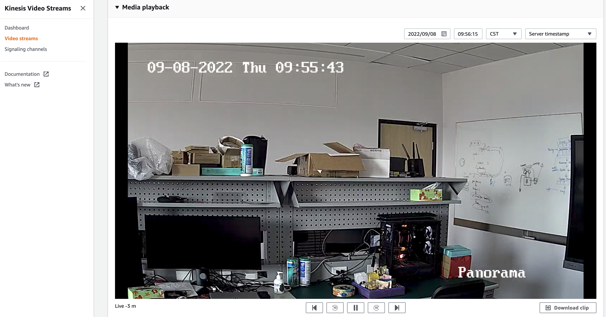

# Run Amazon Kinesis Video Streams in Panorama: Support Multiple Cameras via AWS IoT

## Brief

In this guide, we show how to stream out from Panorama via Amazon Kinesis Video Streams and AWS IoT.

This will include:

- Create AWS resources including AWS IoT Thing, credentials, policy and AWS IAM role.
- Create Panorama multiple data sources(cameras).
- Build Panorama Kinesis Video Streams sample application including Amazon Kinesis Video Streams SDK and GStreamer library.
- Deploy Panorama application and verify live streamings on Amazon Kinesis Video Streams console.

## Why Amazon Kinesis Vides Stream?

Amazon Kinesis Video Streams makes it easy to securely stream video from connected devices to AWS for analytics, machine learning (ML), playback, and other processing. Kinesis Video Streams automatically provisions and elastically scales all the infrastructure needed to ingest streaming video data from millions of devices. It durably stores, encrypts, and indexes video data in your streams, and allows you to access your data through easy-to-use APIs. Kinesis Video Streams enables you to playback video for live and on-demand viewing, and quickly build applications that take advantage of computer vision and video analytics through integration with Amazon Rekognition Video, and libraries for ML frameworks such as Apache MxNet, TensorFlow, and OpenCV.

## Why AWS IoT and AWS IAM?

Devices/cameras can use AWS IAM role and policy to connect to Amazon Kinesis Video Streams services. However it is difficult to design the policy to allow multiple streamings accessibility. According to the resources in a policy document, users can determine which Amazon Kinesis Video Streams stream can be accessible. If the multiple streams are described, this policy is too open. If users describe single stream per policy, it will hit the IAM role and policy amount limitation(5000 maximum).

Devices/cameras can use X.509 certificates to connect to AWS IoT using TLS mutual authentication protocols. Other AWS services (for example, Kinesis Video Streams) do not support certificate-based authentication, but they can be called using AWS credentials in AWS Signature Version 4 format. The Signature Version 4 algorithm normally requires the caller to have an access key ID and a secret access key. AWS IoT has a credentials provider that allows you to use the built-in X.509 certificate as the unique device identity to authenticate AWS requests (for example, requests to Kinesis Video Streams). This eliminates the need to store an access key ID and a secret access key on your device.

The credentials provider authenticates a client (in this case, a Kinesis Video Streams SDK that is running on the camera from which you want to send data to a video stream) using an X.509 certificate and issues a temporary, limited-privilege security token. The token can be used to sign and authenticate any AWS request (in this case, a call to the Kinesis Video Streams). For more information, see [Authorizing Direct Calls to AWS Services](https://docs.aws.amazon.com/iot/latest/developerguide/authorizing-direct-aws.html).

This way of authenticating your camera's requests to Kinesis Video Streams requires you to create and configure an IAM role and attach appropriate IAM policies to the role so that the IoT credentials provider can assume the role on your behalf.

To learn more, please go to [Controlling Access to Kinesis Video Streams Resources Using AWS IoT](https://docs.aws.amazon.com/kinesisvideostreams/latest/dg/how-iot.html)

## Amazon Kinesis Video Streams Producer SDK GStreamer Plugin

[GStreamer](https://gstreamer.freedesktop.org/) is a popular media framework used by a multitude of cameras and video sources to create custom media pipelines by combining modular plugins. The Kinesis Video Streams GStreamer plugin greatly simplifies the integration of your existing GStreamer media pipeline with Kinesis Video Streams. After integrating GStreamer, you can get started with streaming video from a webcam or RTSP (Real Time Streaming Protocol) camera to Kinesis Video Streams for real-time or later playback, storage, and further analysis.

The GStreamer plugin automatically manages the transfer of your video stream to Kinesis Video Streams by encapsulating the functionality provided by the Kinesis Video Streams Producer SDK in a GStreamer sink element, `kvssink`. The GStreamer framework provides a standard managed environment for constructing media flow from a device such as a camera or other video source for further processing, rendering, or storage.

In this sample code, it derives the video data from video output node from Panorama generic APIs and passes the raw video data to GStreamer source element. GStreamer will handle the h264 encoding, parsing and pipe to kvssink to stream out.

To learn more, please go to [Example: Kinesis Video Streams Producer SDK GStreamer Plugin](https://docs.aws.amazon.com/kinesisvideostreams/latest/dg/examples-gstreamer-plugin.html)

## Setup the application

It is highly recommended to use a pre-built enviroment.
- To **set up your environment** for Test Utility, please refer to [Test Utility environment setup](https://github.com/aws-samples/aws-panorama-samples/blob/main/docs/EnvironmentSetup.md). It is highly recommended to use **ARM64 based EC2 instance**.
- Create a role through IAM console and add **AWSIoTFullAccess** permission. This role will be used when the application is going to be deployed.
- Open kinesis_video_streams.ipynb and follow the instructions.

## Deploy Panorama application and verify video streams

After deploying Panorama application via execute all steps in notebook, users can check the video streams on Amazon Kinesis Video Streams console. The **Video streams** are same as camera names. **Chrome** browser is highly recommended for reviewing video playback on Amazon Kinesis Video Streams console. The alternative solution to verify video stream is to use players that support streaming in HLS format, such as **[hls.js](https://hls-js.netlify.app/demo/)**.

## Tips

If you encounter issues during application deployment phase, make sure that application is uploaded to the cloud. Then you can use the graph.json to deploy application in the Panorama console as well.

## Todo

In this sample, the video streams will be continuously delivered to Amazon Kinesis Video Streams. We would add the feature to control on/off for individual camera via AWS IoT to adopt the real use case.