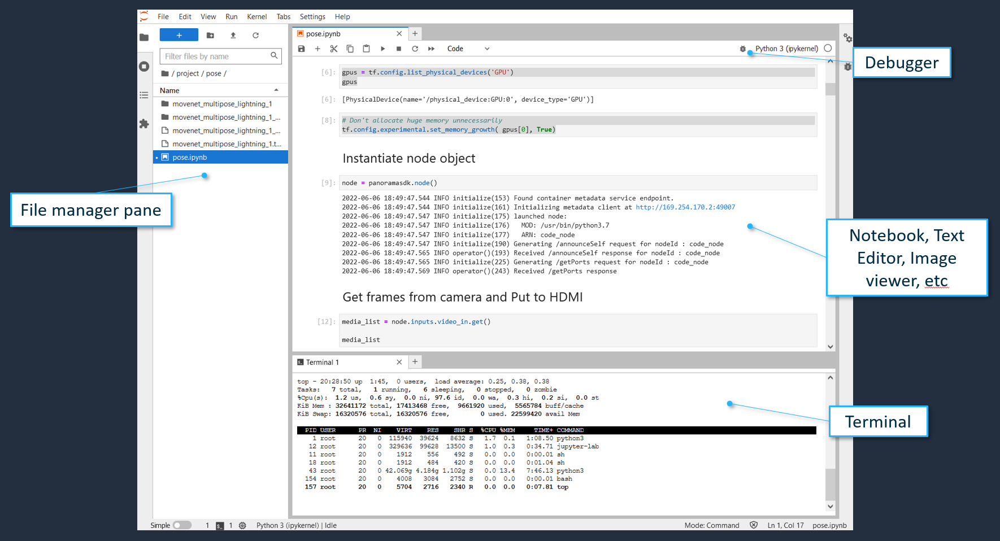
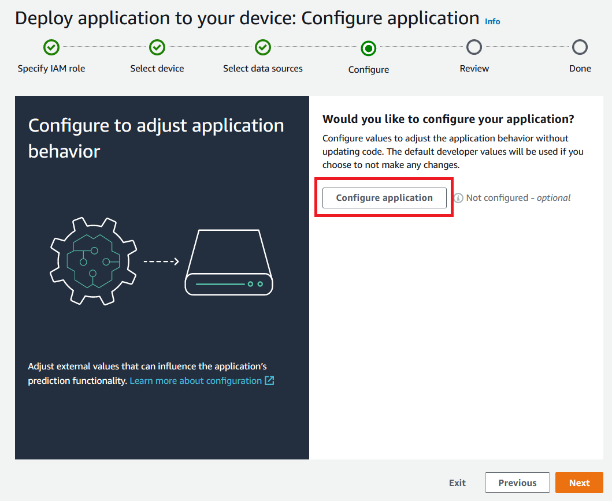

## Overview

**PanoJupyter** is a Panorama application which launches **JupyterLab on Panorama appliance device**. You can quickly prototype Panorama application with a real device.



## Features

* **Quickly iterate** prototyping of Panorama applications by editting and running notebooks on Panorama appliance devices **interactively**.
* Open **Terminal window** within the JupyterLab, and run **shell commands**.(Still within the container.)
* Drag & Drop to **upload files** (Python source files, model data files, configuration files, etc), and **download files** (Updated notebooks, captured images, etc) from the file manager pane.
* **Preview images** (camera images and rendering results) on notebooks, by using matplotlib.pyplot.
* Apply **Python profiler** (cProfile module) to find performance bottleneck in your application.
* Enable **Python debugger**, and use debugger features such as break points, step executions, inspecting variables, etc.


## Quick start

You can use pre-built image to quickly start using PanoJupyter.

1. Choose your preferred deep learning framework and download the pre-built package.
    * TensorFlow : [download](https://panorama-starter-kit.s3.amazonaws.com/public/v2/pano_jupyter/pano_jupyter_tf.zip)
    * Other variations : comming soon
1. Extract the Zip file.
1. Under the "pano_jupyter_\*/" directory, run "panorama-cli import-application" command.
1. Run "panorama-cli package-application" command.
1. Deploy the pano_jupyter_\* app onto device.
    * Option 1 : Use Management Console UI. Please specify the inbound networking port for Jupyter server.
        1. At the "Configure" step in the deployment wizard, click the "Configure application" button. 
        1. Choose "Inbound ports" tab. 
        1. Enable "Open port", configure "Device port" (default: 8888), and "Save" 
    * Option 2 : Edit the "pano_jupyter_\*/graphs/pano_jupyter_\*/override.json" to include cameras you want to use, and deploy pano_jupyter_\* programmatically using graph.json and override.json.
1. Confirm the successful completion of deployment.
1. Identify the IP address of your appliance device. You can use the Management Console UI or "aws panorama describe-device" command.
1. Check "console_output" log stream on CloudWatch Logs, and identify the Jupyter server's security token. This part : http://127.0.0.1:8888/lab?token=`{token}`
1. Open "http://{ip-address-of-appliance}:8888/" with your browser. If security token is asked, use the one you got from the "console_output".
1. Drag & drop "notebook/pose_\*.ipynb", and run. You can write your own notebooks as well.


## How to build (for advanced users)

In order to customize the PanoJupyter application, such as adding more libraries, you can modify the source code (Dockerfile, entry Python script), and build your customized version of PanoJupyter.

1. Log-in to ARM-EC2 instance. You can create it by following [Test Utility environment setup](https://github.com/aws-samples/aws-panorama-samples/blob/pano_jupyter/docs/EnvironmentSetup.md) document.
1. Change directory to "./src/pano_jupyter_\*".
1. Run "panorama-cli import-application".
1. Apply your changes in the source code and Dockerfile under "packages/{account-id}-pano_jupyter_\*_code-1.0/".
    * For pano_jupyter_tf, copy "tensorflow-2.4.4-cp37-cp37m-linux_aarch64.whl" from [TF37_opengpu sample](https://github.com/aws-samples/aws-panorama-samples/tree/main/samples/TF37_opengpu) to "./packages/{your-account-id}-pano_jupyter_tf_code-1.0/"
1. Run "panorama-cli build-container --container-asset-name code --package-path packages/{your-account-id}-pano_jupyter_\*_code-1.0".
1. Create a Zip file of the application, for future use.
    ``` bash
    cd ./src
    python3 archive.py pano_jupyter_tf
    ```
1. Follow steps in "Quick start" above.


## Limitations

* If you reset Jupyter kernel and instantiate panoramasdk.node objects multiple times, panoramasdk APIs don't work as expected. You need to restart the device to clean start the pano_jupyter application.
* You cannot install additional native libraries once deployed. All the native libaries have to be included in the code container image before deployment. Please refer to the "How to build" section above.
